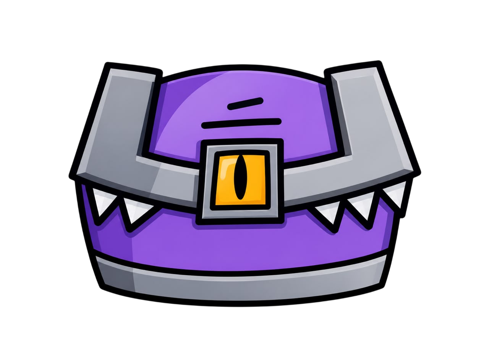
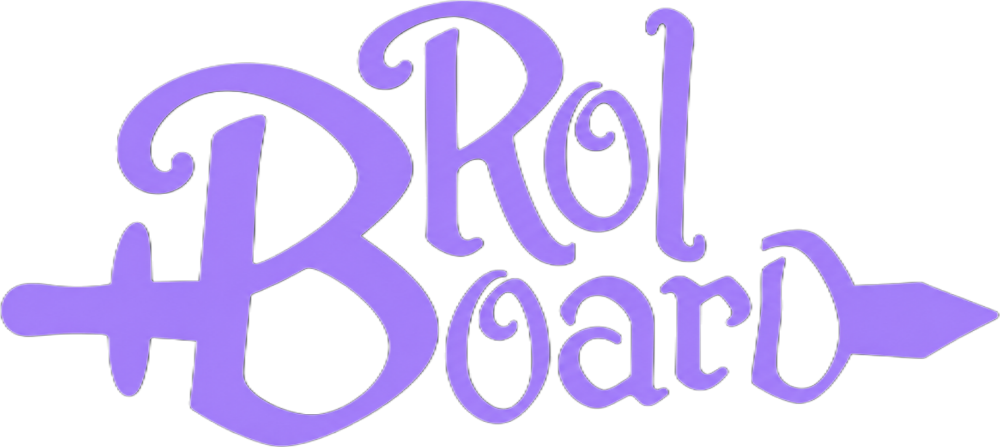

<div align="center">




**Dashboard personal para gestión de campañas de rol de mesa (TTRPG)**

[](https://github.com/ncorrea-13/rolboard/actions/workflows/ci.yml)
[](https://go.dev)
[](https://react.dev)
[](https://www.typescriptlang.org)
[](https://vite.dev)
[](https://caddyserver.com)
[](https://modernc.org/sqlite)
[](https://github.com/ncorrea-13?tab=packages&repo_name=rolboard)
[](#license)

[English](README.md)

</div>

---

App web para dirigir campañas de rol de mesa, enfocada en la narrativa: sesiones, arcos, jugadores, NPCs, locaciones, facciones y quests, más un tracker de combate liviano. No trae reglas: no hay tiradas ni stats; es un lugar para la historia, no un VTT. Pensado para quien dirige: los jugadores no tienen cuenta.

Este proyecto surgió como un traspaso de utilizar Obsidian pero para una gestión más rápida con lo que incluye un indexador del frontmatter para poder traer esta información y poder convivir con la vault. Mantiene la estructura del vault y permite navegar hacia él. Cada campaña guarda su `vault_path`, una subcarpeta dentro de `VAULTS_ROOT`. [`vault-template/`](vault-template/) tiene una estructura de vault que el indexador reconoce sin tocar código.

## Stack

| Capa          | Tecnología                                   |
| ------------- | -------------------------------------------- |
| Servidor      | Go 1.27, `net/http` stdlib                   |
| Base de datos | SQLite (`modernc.org/sqlite`)                |
| Cliente       | React + TypeScript + Vite, servido por Caddy |

Más: [`docs/ARCHITECTURE.md`](docs/ARCHITECTURE.md).

## Inicio rápido

Imágenes precompiladas en GHCR. Funciona con Docker y Podman.

`compose.yaml`:

```yaml
secrets:
  rolboard_admin_token:
    external: true

services:
  server:
    container_name: rolboard-server
    image: ghcr.io/ncorrea-13/rolboard-server:main
    user: "${ROLBOARD_USER:-1000:1000}"
    env_file:
      - .env
    secrets:
      - rolboard_admin_token
    environment:
      DB_PATH: /data/campaign.db
      VAULTS_ROOT: /vaults
      UPLOADS_ROOT: /data/uploads
      PORT: 8080
      ADMIN_TOKEN_FILE: /run/secrets/rolboard_admin_token
    volumes:
      - ${DATA_PATH}:/data
      - ${VAULTS_ROOT_HOST}:/vaults:ro
    logging:
      driver: journald
      options:
        tag: "rolboard-server"
    restart: unless-stopped

  client:
    container_name: rolboard-client
    image: ghcr.io/ncorrea-13/rolboard-client:main
    environment:
      BACKEND_HOST: rolboard-server
    ports:
      - "${CLIENT_PORT}:80"
    depends_on:
      - server
    logging:
      driver: journald
      options:
        tag: "rolboard-client"
    restart: unless-stopped
```

`.env`:

```bash
CLIENT_PORT=8080
DATA_PATH=./data
VAULTS_ROOT_HOST=/ruta/a/los/vaults
# ROLBOARD_USER=0   # solo Podman rootless, ver "Permisos del vault"
```

La imagen del server corre como UID 1000 — `mkdir -p ./data` y `podman unshare chown -R 1000:1000 ./data` (Docker: `chown` común en vez de `podman unshare chown`) antes del primer arranque.

### Permisos del vault

El servidor tiene que poder leer el vault; si no, renderizar notas y reindexar fallan con `permission denied`.

- **Docker (rootful):** el UID 1000 del contenedor es el UID 1000 del host, así que el vault debe ser legible por ese usuario.
- **Podman rootless:** el UID 1000 del contenedor mapea a un sub-UID de tu usuario, no a ti, así que un vault `770` no se puede leer. Pon `ROLBOARD_USER=0` en el `.env`: el root de un contenedor rootless es tu propio usuario sin privilegios, no root del host, y el vault se monta read-only.

No pongas `ROLBOARD_USER=0` en Docker rootful: ahí es root real.

Crear el secret del token de admin y levantar:

```bash
# Podman
printf '%s' 'tu-admin-token' | podman secret create rolboard_admin_token -
podman compose up -d

# Docker (los secrets externos requieren modo Swarm)
docker swarm init
printf '%s' 'tu-admin-token' | docker secret create rolboard_admin_token -
docker compose up -d
```

En Docker sin Swarm, reemplaza `external: true` por `file: ./secrets/admin_token` y pon el token en ese archivo.

`logging: journald` requiere un host con systemd; si no, quita esos bloques.

Abre `http://localhost:${CLIENT_PORT}`, entra como admin con el token, crea una campaña y asígnale su código de acceso.

## Configuración

| Variable              | Dónde    | Descripción                                                                                                                             |
| --------------------- | -------- | --------------------------------------------------------------------------------------------------------------------------------------- |
| `CLIENT_PORT`         | host     | Puerto del host para el cliente web                                                                                                     |
| `DATA_PATH`           | host     | Carpeta del host para la base y las imágenes subidas                                                                                    |
| `VAULTS_ROOT_HOST`    | host     | Carpeta del host con el vault de cada campaña como subcarpeta (montada read-only)                                                       |
| `ROLBOARD_USER`       | host     | Usuario del contenedor (`uid:gid`). Default `1000:1000`. Podman rootless: `0` (ver [Permisos del vault](#permisos-del-vault))           |
| `DB_PATH`             | servidor | Ruta del archivo SQLite                                                                                                                 |
| `VAULTS_ROOT`         | servidor | Ruta del mount de vaults                                                                                                                |
| `UPLOADS_ROOT`        | servidor | Ruta de imágenes. Sin default — ponla dentro del volumen de datos                                                                       |
| `PORT`                | servidor | Puerto de escucha (el cliente proxea a `8080`)                                                                                          |
| `ADMIN_TOKEN_FILE`    | servidor | Archivo con el token de admin (secret). Tiene prioridad sobre `ADMIN_TOKEN`                                                             |
| `ADMIN_TOKEN`         | servidor | Token de admin como env var plana (solo dev)                                                                                            |
| `COOKIE_SECURE`       | servidor | `false` solo para HTTP local. Default: cookies seguras                                                                                  |
| `LOG_JSON`            | servidor | Logs estructurados JSON (`log/slog`). Default: texto legible                                                                            |
| `TRUST_PROXY_HEADERS` | servidor | Confía en `CF-Connecting-IP` para el rate limit. Solo si todo el tráfico pasa por Cloudflare — si no, es falsificable. Default: `false` |
| `BACKEND_HOST`        | cliente  | Host del backend para el proxy de `/api`. Default: `localhost`                                                                          |

## Desarrollo

`docker-compose.yml` buildea ambas imágenes desde el código, corre el cliente en el namespace de red del servidor y usa `ADMIN_TOKEN` del `.env`:

```bash
cp .env.example .env
docker compose up --build   # o: podman compose up --build
```

## API

REST + JSON bajo `/api`. Lista completa: [`docs/API.md`](docs/API.md).

## Estructura del Proyecto

`server/` (Go) y `client/` (React/TS). Layout: [`docs/ARCHITECTURE.md`](docs/ARCHITECTURE.md).
Razonamiento detrás de cada decisión de alcance: [`docs/DECISIONS.md`](docs/DECISIONS.md).

## Sobre el proyecto

Proyecto personal, pensado como ejercicio deliberado de aprendizaje de Go. [`AGENTS.md`](AGENTS.md) describe el alcance de la asistencia de IA en este repo.

## Licencia

MIT - [LICENSE](LICENSE) para más información.

Los logos e íconos (`client/public/logo-*.png`, `client/public/favicon.png`) son © Mateo Guareschi y se usan con su permiso. **No** están cubiertos por la licencia MIT.

---

_Mendoza, Argentina · Nicolás Correa ([ncorrea-13](https://github.com/ncorrea-13))_